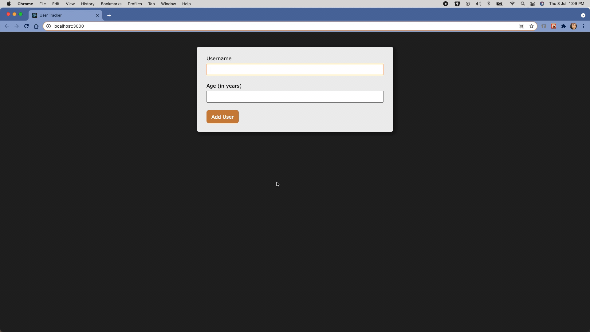

# User Tracker

## Table of Contents

1. [Overview](#overview)
2. [Installation](#installation)
3. [Bootstrapping](#bootstrapping)
4. [Credits](#credits)

## Overview

This is a React application that lets you track users. The application allows you to view an existing user's name as well as age and register a new user to the list of existing users.

Note that providing the name and age of a user is mandatory before adding a user to the list of existing users (white spaces are not allowed). If you try provide either of them as empty values, you will see a modal opening up and displaying the error message to not keep name and age blank. If you try to add a user with age less than 1 year, the modal will open displaying an error message to not keep age less than 0.

The application is responsive to devices of all screen sizes.

## Installation

1. Clone the [repository](https://github.com/srishti/react-user-tracker) using Git on your machine. Alternatively, download the `.zip` file of current repository on your machine and then unzip the downloaded zipped file.
2. Go inside the application's directory on your local machine.
3. Install all packages using the following command:\
   `npm i`
4. Run the application using the following command:\
   `npm start`

The application will be run in the development mode.\
Open [http://localhost:3000](http://localhost:3000) to view it in the browser.

The page will reload if you make edits.\
You will also see lint error, if any, in the console.

## Bootstrapping

This application was bootstrapped with [Create React App](https://github.com/facebook/create-react-app).

## Credits

This project is my own version of code while learning React from the course [React - The Complete Guide](https://www.udemy.com/course/react-the-complete-guide-incl-redux/) by _Maximilian Schwarzmüller_ on Udemy.  
Thank you, Maximilian!
